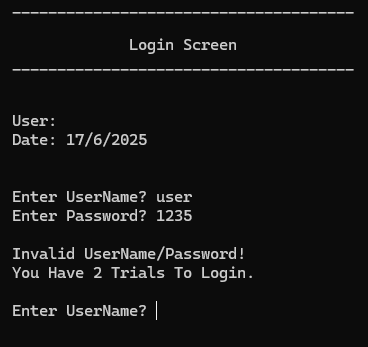
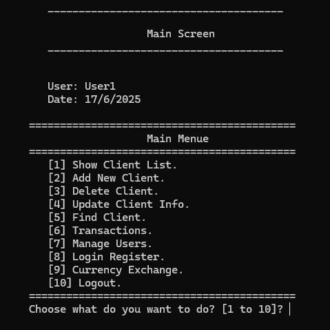
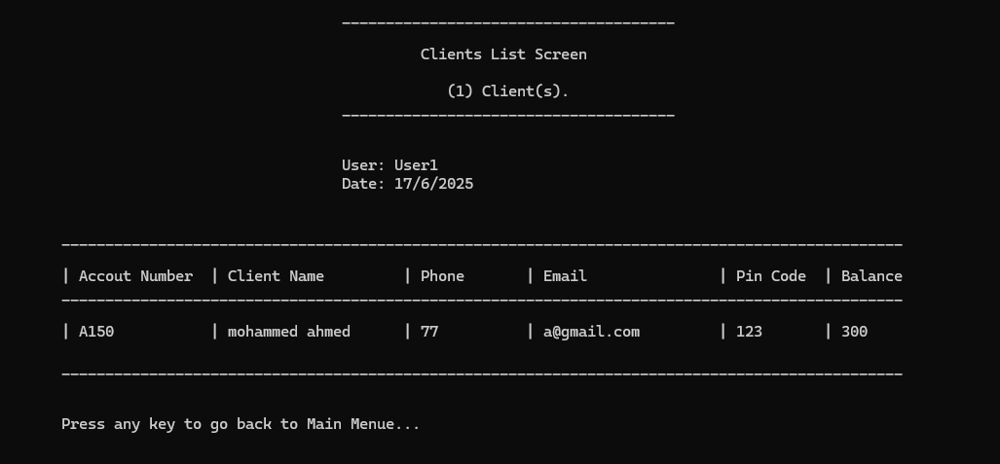

# BankSystem-OOP
#  نظام إدارة بنك باستخدام البرمجة الكائنية (C++)

نظام مكتبي يُحاكي بيئة عمل بنك حقيقي، تم تصميمه باستخدام مبادئ البرمجة الكائنية (OOP) بلغة ++C، ويهدف إلى إدارة الحسابات البنكية، الصلاحيات، وسجلات الدخول، بالإضافة إلى محاكاة عمليات تبادل العملات.

---

##  فكرة المشروع

يقدّم هذا النظام وظائف متكاملة تشمل:

- إدارة حسابات العملاء (فتح حساب، سحب، إيداع، عرض الرصيد).
- إدارة بيانات المستخدمين (موظف – مدير).
- التحكم بالصلاحيات (من يستطيع تنفيذ ماذا).
- تتبع من دخل النظام ووقت الدخول.
- دعم نظام تبادل العملات داخل النظام البنكي.

---

## الهدف التقني (لمشروع نظام البنك)
- تطبيق مفاهيم البرمجة الكائنية (OOP) بشكل عملي على نظام واقعي يحاكي عمل البنوك.
- تنظيم الكود وتقسيمه وفق مبادئ الكبسلة والتجريد والوراثة لتسهيل القراءة والصيانة.
- تقليل التكرار وتحقيق إعادة الاستخدام (Code Reusability) باستخدام الواجهات والكلاسات المجردة.
- غرس الفهم العميق للتصميم الكائني من خلال بناء هيكل برمجي يحاكي الواقع مثل:
    استخدام OOP كأداة لفهم كيفية بناء أنظمة حقيقية منظمة وقابلة للتوسعة مستقبلًا.

---

##  الأدوات والتقنيات المستخدمة

- **اللغة:** ++C
- **بيئة التطوير:** Visual Studio أو أي بيئة تدعم ملفات ++C
- **البرمجة الكائنية (OOP):**
  - الكبسلة (Encapsulation)
  - التجريد (Abstraction)
  - الوراثة (Inheritance)
  - تعدد الأشكال (Polymorphism)
- تخزين البيانات باستخدام ملفات نصية (I/O)

---

##  دوري كمطور

- بناء بنية برمجية واقعية باستخدام مفاهيم OOP الكاملة.
- تصميم كائنات منظمة تمثل العملاء والمستخدمين والصلاحيات.
- كتابة كود نظيف وسهل القراءة مع احترام مبادئ التصميم.
- استخدام إدارة دقيقة للذاكرة والتعامل مع الملفات.
- تطبيق كامل لمفاهيم التجريد والواجهات والمرونة البرمجية.

---

##  مميزات النظام

- واجهة نصية سهلة الاستخدام.
- هيكل برمجي قابل للتوسعة وإضافة ميزات جديدة.
- نظام صلاحيات مضبوط لتفادي العبث بالبيانات.
- دعم تسجيل وقت دخول المستخدمين.
- دعم ميزة تبادل العملات داخل الحسابات.

---

##  طريقة التشغيل

1. افتح المشروع باستخدام Visual Studio أو محرر يدعم C++.
2. شغّل الملف الرئيسي `main.cpp`.
3. اتبع التعليمات النصية الظاهرة في الواجهة لاستخدام النظام.

---

## 📌 ملاحظات

- المشروع موجه كمحاكاة تعليمية لفهم عميق لمبادئ OOP في ++C.s
- لا يستخدم مكتبات خارجية أو واجهات رسومية، بل يركز على منطق العمل والهيكلية البرمجية.

---

## 📸 صور من النظام

### 🔐 شاشة الدخول

### 🏠 الشاشة الرئيسية

### 👥 شاشة عرض العملاء

---

## 🚀 تحسينات مستقبلية

> هذه اقتراحات مستقبلية للفهم والتطوير لاحقًا، وليست جزءًا من التطبيق الحالي.

- إضافة واجهة رسومية.
- ربط النظام بقاعدة بيانات خارجية بدل الملفات.
- تصدير تقارير العملاء والمعاملات إلى PDF.
- اضافات اخرى.

---

## 📬 المطور

- محمد أحمد أحمد الهزمي
- ايميل : alhazmimohammed663@gmail.com
